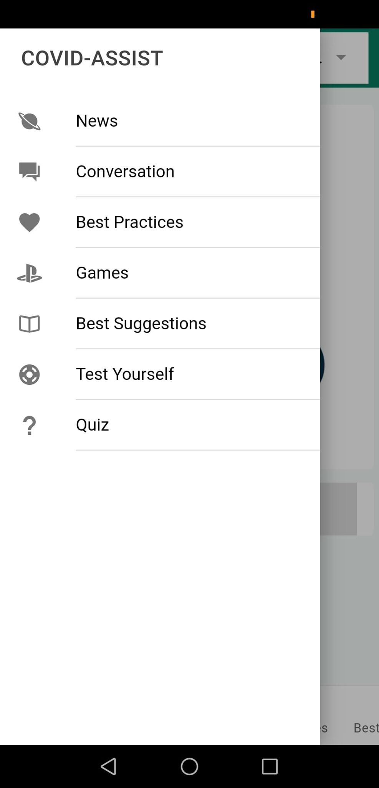
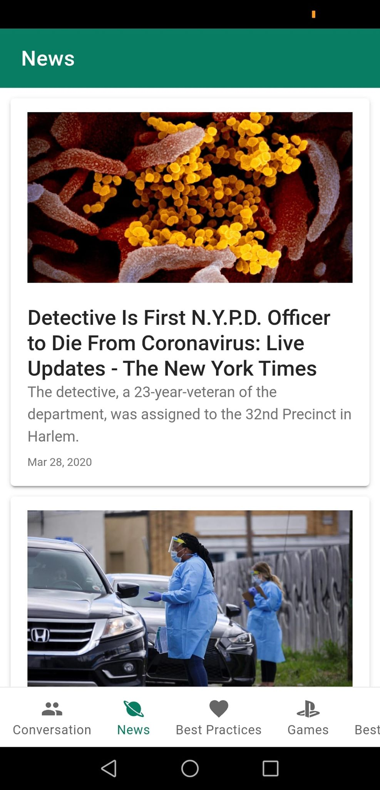
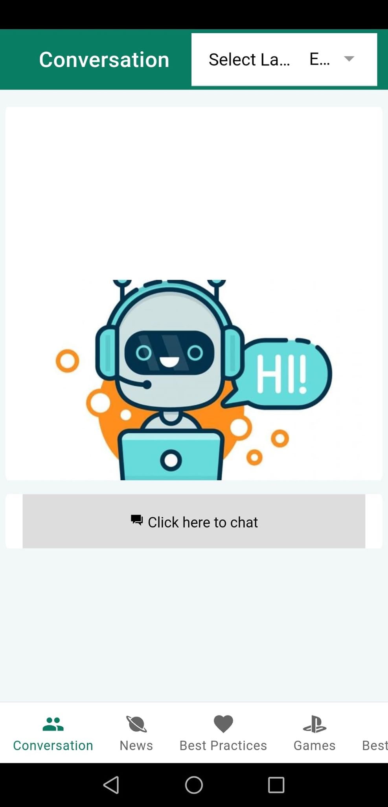
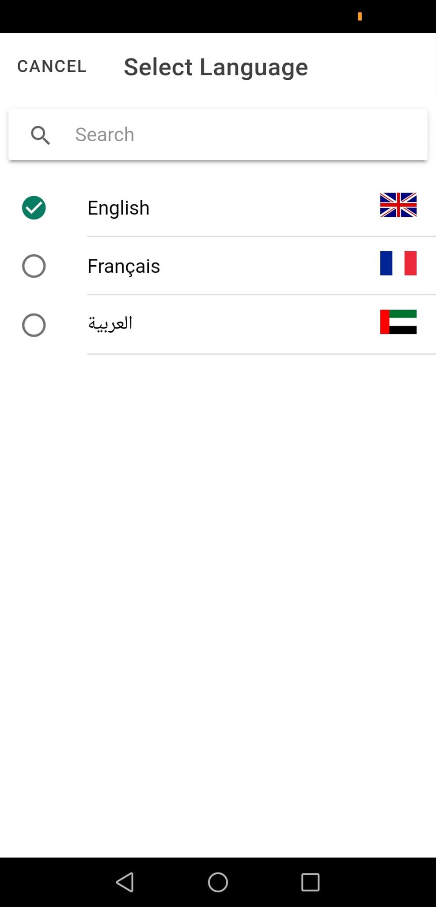
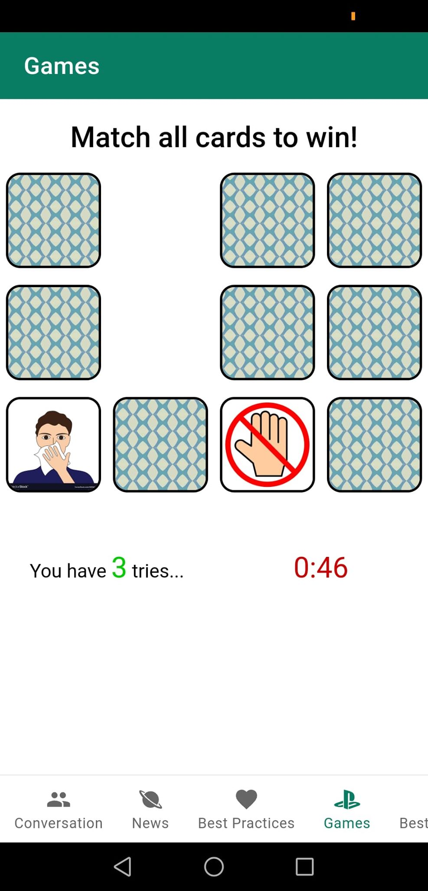
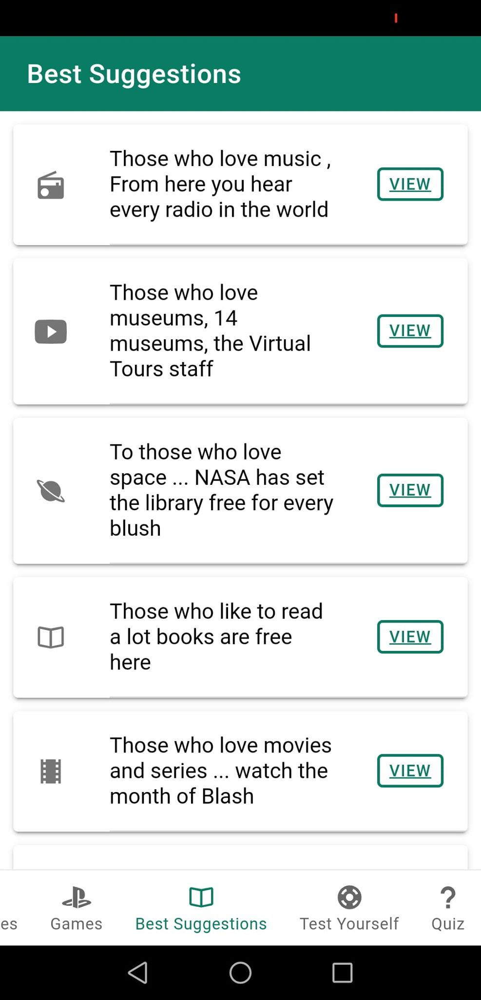
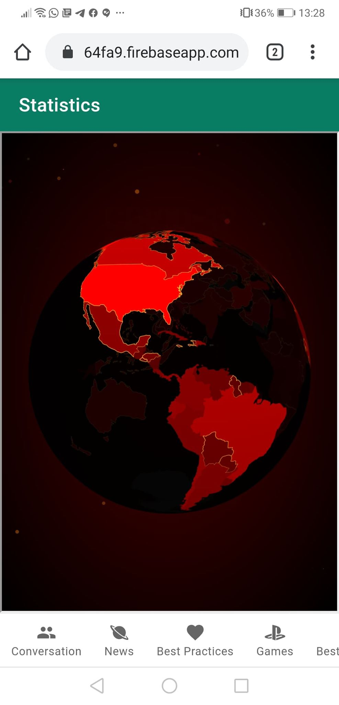
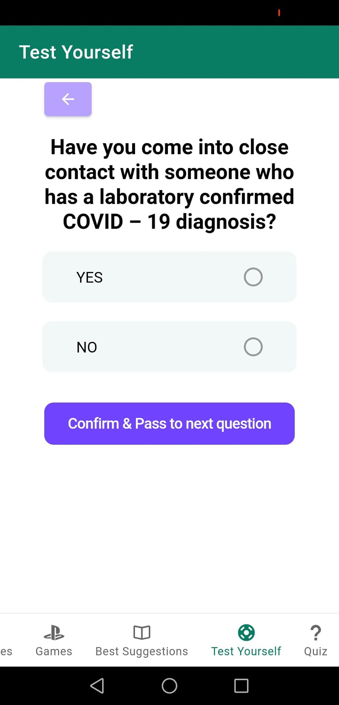
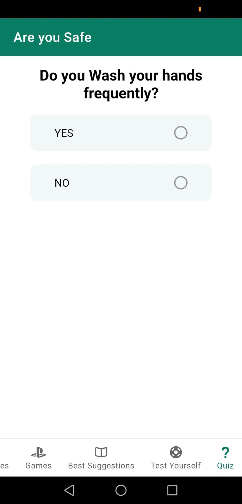

This software product is a proof of concept (POC) whose purpose is to demonstrate that the use of new technologies helps to manage specific situations. We have adapted this application to the crisis of the moment, certainly one of the most important facing the world: the covid-19 virus. Not all features have been fully completed.

COVIDASSIST

The COVID-19 virus presents an unprecedented, global challenge. When citizens are doing their part by social distancing, healthcare workers and first responders are taking care of many of us. Our contribution is creating an innovative product, CovidAssist, focus on awareness on the Corona Virus Pandemic. Awareness content should comply with the information published by UAE official health department (Official information on Covid-19 will be provided to participants).
THE TEAM

COVID-ASSIST is a Mobile (android and ios), Desktop and web application   developed by Mr. RhibiHamdi , Mr. Skander Ben Khelil , Dr. Mokhtar Sellami , Dr. Ramzi Guetari and  Pr. NaoufelKraiem.
DEFINITIONS, ACRONYMS AND ABBREVIATIONS

‒	Fake news 

‒	Chat-bot

‒	Internationalization (multi languages :arabic , english , french)  

‒	Kids game 

‒	Best Practices 

‒	Best suggestions 

‒	Quiz 

‒	Test Yourself  

‒	user Tracking

MAIN FEATURES

At the present time the following features at the present time, the following features are fully or partially implemented: a chat bot, world news (about Corona), educational videos for the prevention and protection against covid-19, leisure activities such as a cultural component and games, a test checking if someone is or is not infected, a quiz, user tracking, and localization of the user interface (multi-lingual).
 

●	Chat-bot interface where users can ask questions and get an instantaneous response (developed by artificial intelligence:  machine learning/Deep Learning, NLP Natural Language Processing) also there will be given some suggestion questions .

	

●	Real time world health news (news are fetched every 2 seconds from many sources  , News API searches articles at over 30,000 worldwide sources, including ) 
 	 

●	videos including the best practices to keep safe against coronavirus ( source:  .

●	in order to make kids more awareness we developed a game including some photos like (mask, hand washing …)  .
 	 

●	To keep our application different and to make it as a reference we had including the best free current opportunities around the world (books,films,museums. )and some useful link as (latest coronavirus statistics on spread, 24h mecca live etc. .. ) 
 	 

●	In order to detect if User is infected or not the Test yourself section include some number of questions ( every question have some specific score ) and depend on the user responses our application will inform if this user  need to call a doctor or not . 

(clarification : if the user score pass 5 the response will be “you need to call doctors” , “you are good otherwise “ . 
 	 

●	Quiz is an interaction quick game between our application and users with the intention of doing quick lesson

 	 

●	Games: 
 	 

●	USER TRACKING:a system of user tracking will check the distance traveled by user and launch a notification (included the text “Wash Your hand “if the user pass 200 meter of his first position.(clarification:these functionalities can be tested only on phone. for that you will receive an apk version of our application so you have to install it in your device and you will receive the notification sense you exceed a distance 10 meter by walking   )  

	
 

user specifications: there isn’t a specific user for this application, actually this application dedicated for everyone 
		
		

Non functional requirements (Generalconstraint):

●	Network connection: some functionalities need network connection such (news,chatbot , best practices  , user tracking )  . 

●	Application installed .

●	Localisationactivated.

●	OS (iosou android) also you will be able to install this application on desktop , finally you can deploy it on a web 
host , ( you will find our application also on the firebase web host  : https://covidassist-64fa9.firebaseapp.com   ) 

Technical tools :

❖	Versionning tools: Github.

❖	Communication tools: slack.

❖	check progression tools : Trello.

❖	technologies used : 

➢	Ionic 4 

